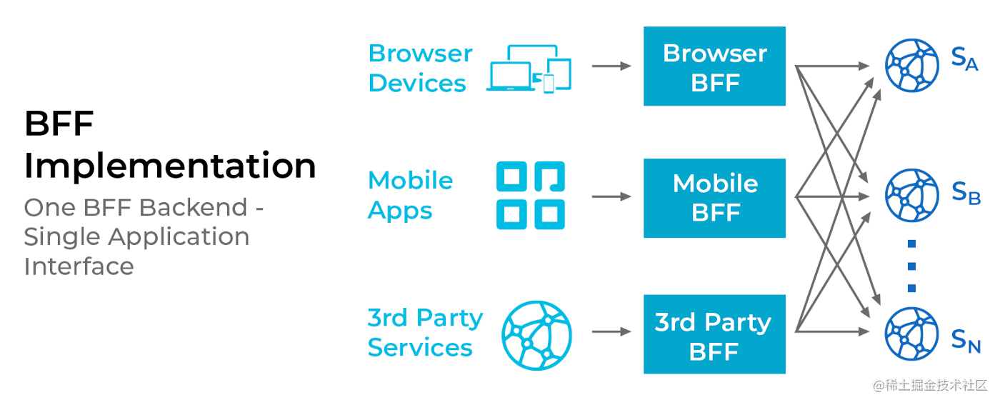

# BFF 介绍

BFF(Backend For Frontend)层基本上是一个编排器层(orchestrator layer)，也称为前端的后端。

当编排器层包括聚合、计算、某些数据的组合时，它就不仅仅是一个简单的 API 网关。
由于大多数公司出于一些原因（可扩展性、开发成本、可维护性等）而转向微服务架构。
因此，考虑到每个客户端都有不同的规范和不同的数据要求，每个微服务都很难为其每个客户端提供准确的 API。

> BFF会根据不同的客户端需求，提供不同的接口。

